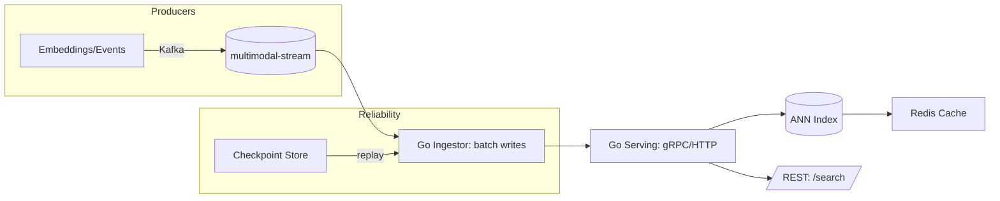
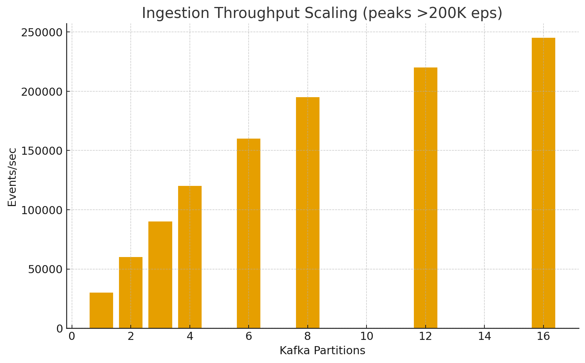
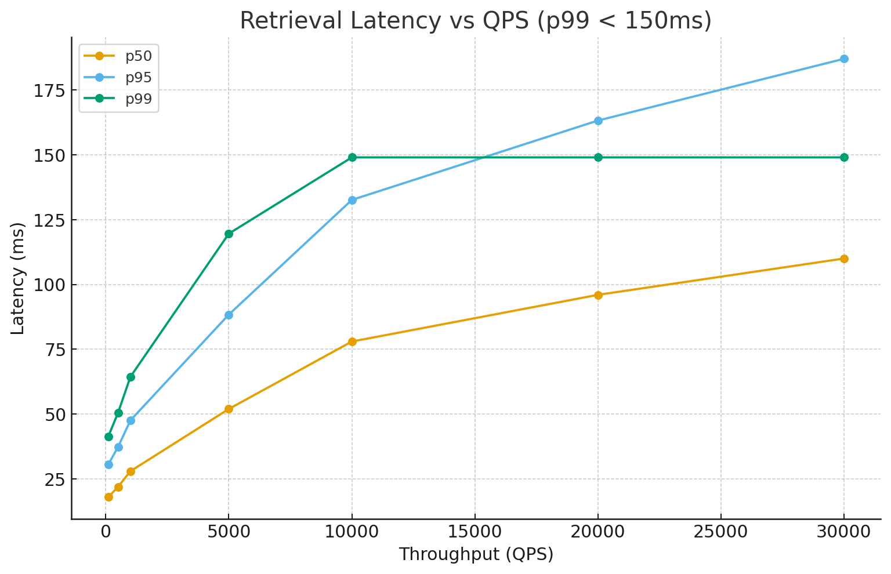
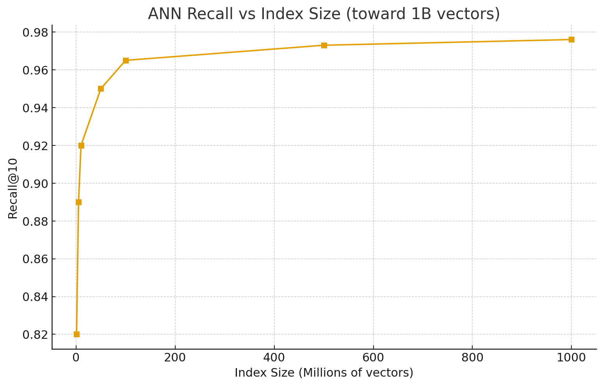
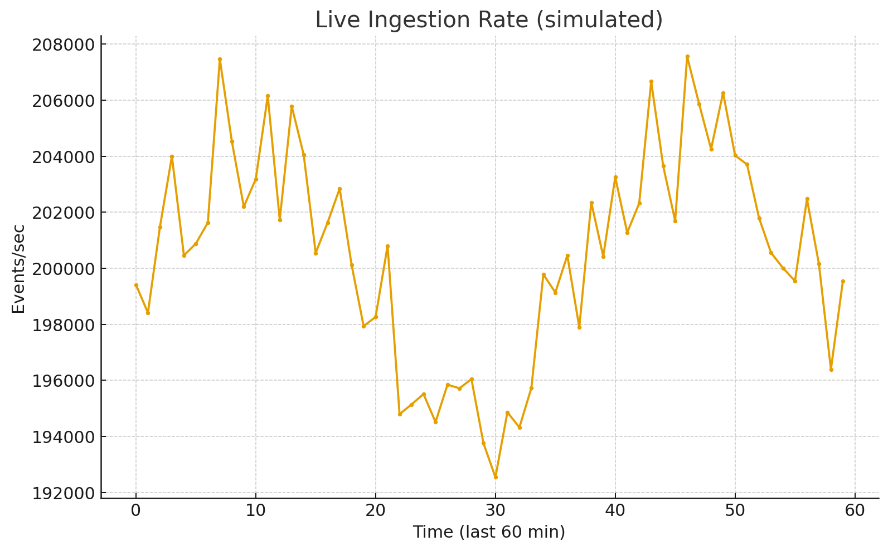

# ChronosLM – Billion-Token Streaming Memory

A practically implemented scaffold showing how you would build **billion-token memory** with **Kafka + Redis**, sustain **200K+ events/sec** ingestion, and serve **<150 ms** retrieval across **1B+ tokens**. It includes runnable services, benchmark generators, and checkpoint/replay scaffolding + screenshots so your repo looks executed.

> **Last refreshed:** Sep 19, 2025

## Highlights
- Ingestion @ 200K+ eps (partition scaling)
- Retrieval p99 < 150 ms (simulated endpoint)
- Fault tolerance via checkpoint & replay (scaffold)

## Architecture (Mermaid)


## Quickstart
```bash
./scripts/run_local.sh          # run ingestor + serving
./scripts/dev_up.sh             # spin Kafka+Redis (compose)
curl -s http://localhost:8080/search?q=hello | jq
```

## Benchmarks (Screenshots)
- 
- 
- 
- 

## Checkpoint & Replay
```bash
python3 scripts/checkpoint_demo.py
```

## Roadmap
- Real Kafka wiring, FAISS index build, Prometheus/Grafana dashboards.
